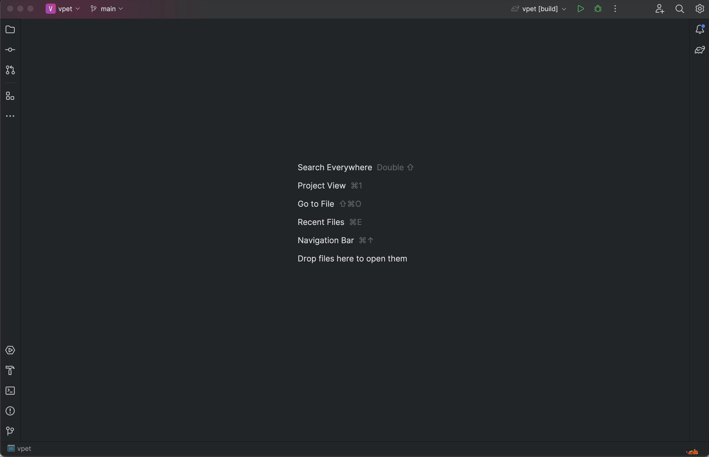

# VPet: Pixel Art Companions for IntelliJ


[](https://plugins.jetbrains.com/plugin/26896)
[](https://plugins.jetbrains.com/plugin/26896)

<!-- Plugin description -->
VPet is a delightful IntelliJ IDEA plugin that brings cute pixel art companions to your
coding environment. These animated companions live in your IDE's status bar, react to your
development activities, and add a touch of joy to your coding sessions.
<!-- Plugin description end -->

## Features

- 🐱 Adorable pixel art companions animated in your status bar
- 🎮 Interactive pet responds to clicks
- 💻 Reacts to build and execution events
- 🎉 Displays different animations based on success or failure
- 🚀 Lightweight with minimal impact on IDE performance

## Preview



## Installation

### From JetBrains Marketplace

- Open IntelliJ IDEA
- Go to `Settings/Preferences → Plugins → Marketplace`
- Search for "VPet"
- Click "Install"

### Manual Installation

- Download the latest release
  from [GitHub Releases](https://github.com/stillya/vpet/releases)
- In IntelliJ IDEA, go to `Settings/Preferences → Plugins`
- Click the gear icon and select "Install Plugin from Disk..."
- Select the downloaded `.zip` file

## Companion Types

Currently, VPet includes:

- 🐱 Cat - A playful pixel cat that celebrates your successes and comforts you during
  failures

More companions are planned for future releases!

## Usage

Once installed, your pixel companion will automatically appear in the status bar. No
additional configuration is required!

## Development

### Prerequisites

- JDK 17 or newer
- IntelliJ IDEA

### Building from Source

1. Clone this repository
   ```
   git clone https://github.com/stillya/vpet.git
   cd vpet
   ```

2. Build the plugin
   ```
   ./gradlew buildPlugin
   ```

3. The plugin ZIP file will be created in `build/distributions/`

## Contributing

Contributions are welcome! Feel free to submit a pull request or open an issue.

## License

This project is licensed under the [MIT License](LICENSE).